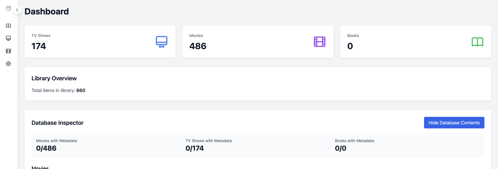
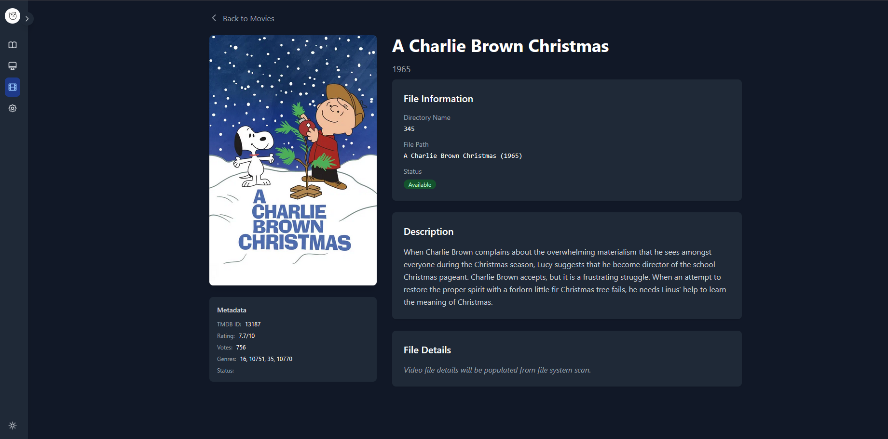
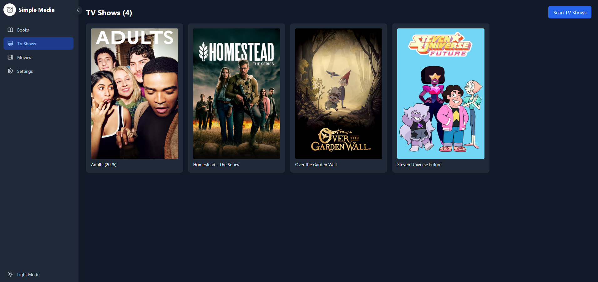
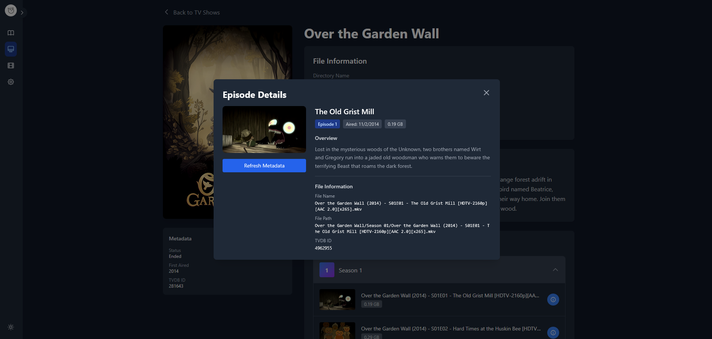

# Simple Media

A lightweight media management system for organizing TV shows, movies, and books.

## Screenshots

### Dashboard

### Movie Details

### TV Show Details

### Episode Details

## Overview

The overall goal of this project is to create a way to manage media, in a 'lighter' way, the arr stack feels very bulky
I understand the need for seperation at times, but I do not understand the need for a different app and setup solely for
a different type of media.

## Features

### Media Management

- **TV Shows**: Automatic metadata fetching from TVDB, episode tracking, season organization
- **Movies**: TMDB integration for posters, descriptions, and ratings
- **Books**: Support for ebooks and audiobooks organized by author and series

### Metadata

- Manual metadata refresh per item or bulk operations
- Clear and re-fetch metadata when needed
- Local metadata caching to reduce API calls
- Poster/cover art display

### Scanning

- Real-time scan progress with visual indicators on grid items
- Individual or full library scans
- File system monitoring for new media

### Media Details

- Episode-level viewing for TV shows with TVDB metadata integration
- Season and episode organization
- Play/download links (when paths are accessible)

### Settings

- TVDB and TMDB API key configuration
- Library path management for TV, movies, and books
- Bulk metadata operations
- Test API connectivity

## Current Goal

Currently this is basically a glorified media scanner with metadata fetching and a frontend to view the media. My immediate focus is making this actually useful beyond just displaying things nicely. Right now I'm thinking:

- Write metadata to NFO files so it persists and works with Kodi/Jellyfin/Plex
- Add a global search bar that works across all media types with basic filtering
- Show library statistics on the dashboard (total items, disk usage, recently added stuff)
- Track watch/read progress so you know what you've actually watched or read

After that, probably add more settings people expect, in-app metadata editing, maybe automatic file organization and renaming.

## Tech stack

### Frontend
- React + Typescript + Vite
- Tailwind CSS

### Backend

- Node.js + Typescript

### Database

- SQLite

### Containerization

- Docker + Docker Compose
